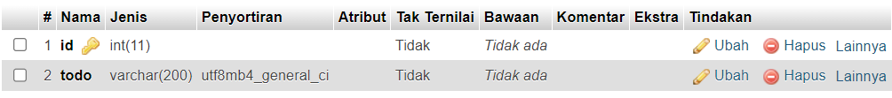
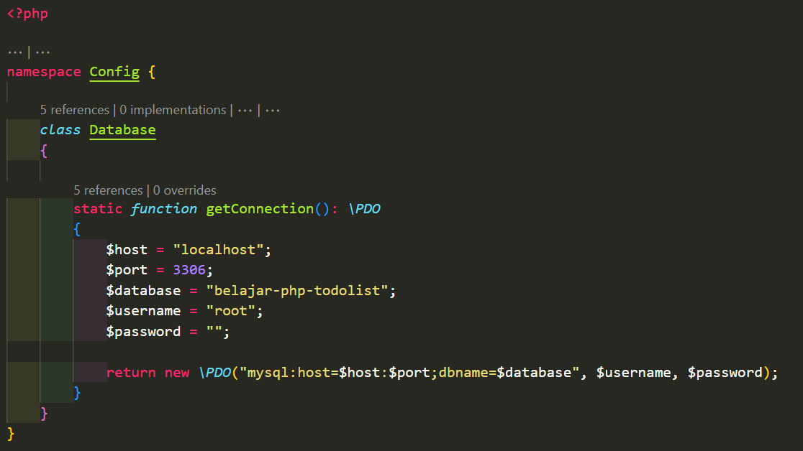
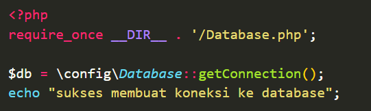
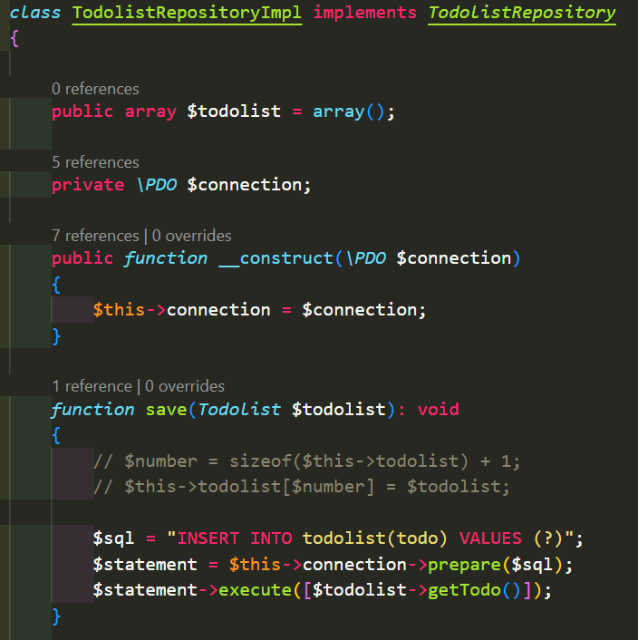
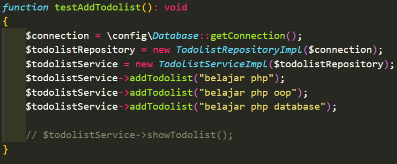
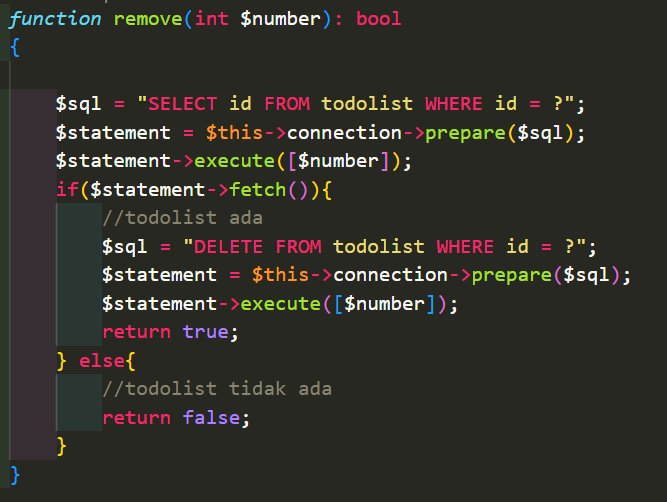
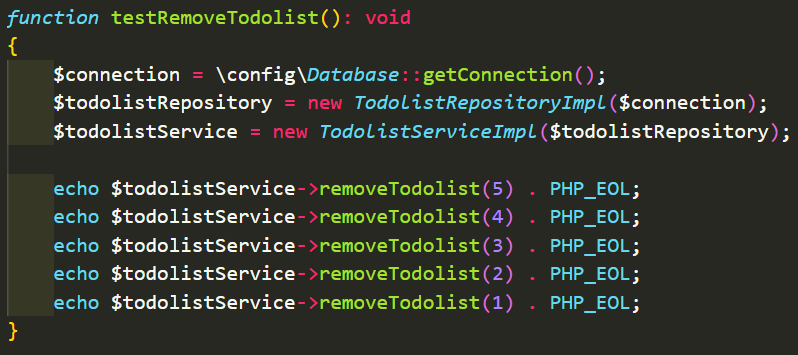
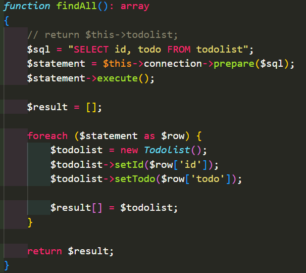
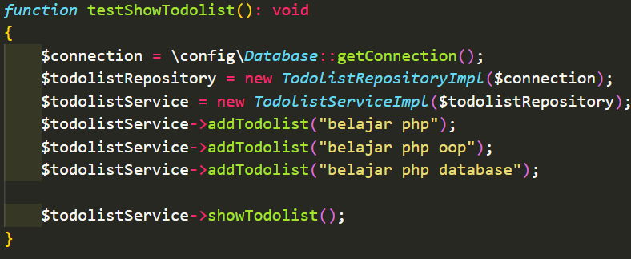

# APLIKASI TODOLIST MYSQL

## A. POINT UTAMA

### 1. Membuat Table

- Buat id nya menjadi `primary key` dan todo.

  

---

### 2. Koneksi Ke Database

- Buat folder baru `config` dan didalamnya file `Database` untuk koneksi ke database.

  

- Buat file `testDatabase` didalam folder yang sam untuk test koneksi ke database.

  

---

### 3. Implementasi Tambah Todolist Ke Repository

- Implementasi tambah todolist

  

- Test tambah todolist

  

---

### 4. Implementasi Hapus Todolist Ke Repository

- Implementasi hapus todolist

  

- Test hapus todolist

  

---

### 5. Implementasi Menampilkan Todolist Ke Repository

- Implementasi menampilkan todolist

  

- Test tampil todolist

  

---

## B. CATATAN & PERTANYAAN TAMBAHAN

- Apa perbedeaan text editor yang dipakai berpengaruh dalam membuat sebuah program?

---

## C. KESIMPULAN

- Mampu mengimplementasikan dari vidio `Belajar PHP MYSQL`, menjadi sebuah program sederhana.
